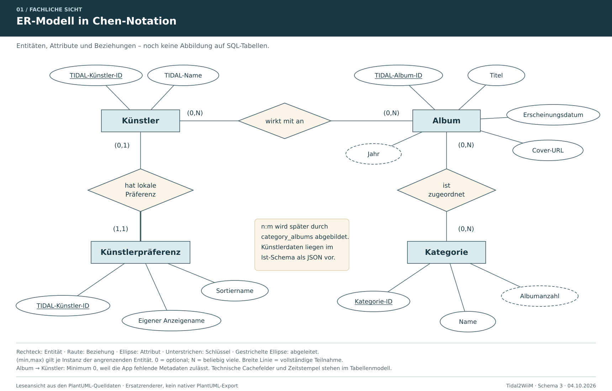
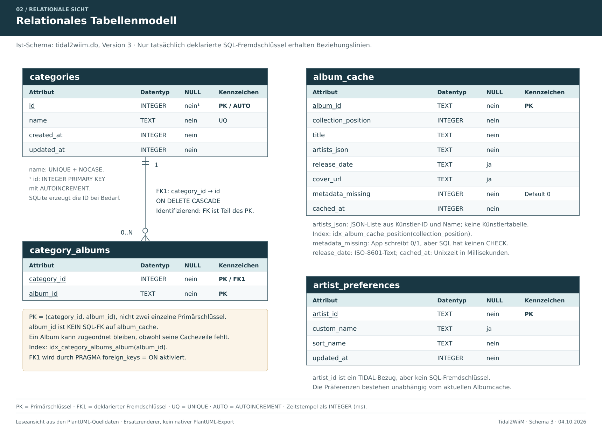

# Tidal2WiiM

**Das persönliche digitale Plattenregal für TIDAL – entwickelt mit Flutter für ein Android-Tablet.**

*Das Titelbild verwendet die Startgrafik der App. Die in der Grafik enthaltenen Zahlen sind Teil des Motivs.*

## Wie es zu dem Projekt gekommen ist

Ich höre Musik über TIDAL und einen WiiM Pro -> Fosi Audio ZH3 -> Fosi Audio ZA3. Mit einer wachsenden Albensammlung fehlte mir jedoch eine Möglichkeit, meine Musik so zu ordnen, wie ich es von einem Plattenregal gewohnt bin: nach Künstlern und Bands, mit deren Alben übersichtlich an einem Ort.

TIDAL bietet zwar Playlists, aber keine frei gestaltbare Ordnerstruktur für eine solche Albumverwaltung. Auch die Einbindung in die WiiM-App schloss diese Lücke für mich nicht: Sie greift auf die von TIDAL bereitgestellte Bibliothek und deren Metadaten zurück, ergänzt jedoch nicht die gewünschte persönliche Ordnung.

Daraus entstand die Idee zu **Tidal2WiiM als „Missing Link“ zwischen Streaming-Bibliothek und persönlichem Plattenregal**. Die App fasst Alben in Künstler- und Bandordnern zusammen und ergänzt eigene Kategorien sowie individuell anpassbare Anzeige- und Sortiernamen. So lässt sich die Sammlung nach den eigenen Vorstellungen durchstöbern und verwalten – und die ausgewählte Musik anschließend in TIDAL öffnen.

Die Entwicklung erfolgte schrittweise mit Unterstützung von ChatGPT (Tests und Fehlersuche): zuerst eine lauffähige Flutter-App auf dem Tablet, dann die TIDAL-Anmeldung und der Zugriff auf die Sammlung. Es folgten Künstlerordner, Kategorien, Albumdetails und die Übergabe an TIDAL. Im praktischen Einsatz kamen weitere Verbesserungen hinzu – etwa lokale Caches, eine dauerhaft gespeicherte Anmeldung und ein eigener Künstlereditor.

Auch optisch sollte sich die App wie eine Musiksammlung anfühlen. So entstanden durch ChatGPT die Startseite mit Plattenspieler und Plattenregal sowie das passende App-Icon. Ein wenig HiFi-Nostalgie gehört schließlich dazu.

## Was umgesetzt wurde

| Bereich | Umgesetzte Funktionen |
| --- | --- |
| **TIDAL-Anbindung** | Anmeldung am eigenen TIDAL-Konto und vollständiges, seitenweises Laden der gespeicherten Alben. |
| **Coverübersicht** | Übersicht der Sammlung mit Albumcovern, Albumtiteln, Künstlern und Erscheinungsjahr. |
| **Suche und Sortierung** | Sammlung durchsuchen und Alben unterschiedlich sortieren, unter anderem nach Künstler und Jahr. |
| **Künstlerordner** | Automatische Gruppierung der Alben nach Künstlern mit A–Z-Navigation. |
| **Eigene Künstlernamen** | Lokale Anzeige- und Sortiernamen; zusätzlicher Editor zur gemeinsamen Bearbeitung der Künstler-Sortiernamen. |
| **Eigene Kategorien** | Kategorien anlegen, umbenennen und löschen sowie Alben einer oder mehreren Kategorien zuordnen. |
| **Albumdetails** | Detailansicht mit Cover, Albuminformationen und Titelliste. |
| **Übergabe an TIDAL** | Ein vollständiges Album oder einen einzelnen Titel gezielt in der TIDAL-App öffnen. |
| **Lokale Speicherung** | Album-Metadaten in SQLite und Cover als lokale Dateien speichern und beim nächsten Start wiederverwenden. |
| **Sammlung aktualisieren** | Die lokale Bibliothek mit TIDAL abgleichen und neu hinzugefügte Alben übernehmen. |
| **Anmeldung beibehalten** | Sitzung sicher speichern, beim App-Start wiederherstellen und Zugangstoken bei Bedarf erneuern. |
| **Tablet-Bedienung** | Eigene Startseite, getrennte Sammlungs- und Einstellungsansicht, App-Icon und Schließen der Bildschirmtastatur beim Öffnen eines Suchtreffers. |

Die persönlichen Kategorien und Künstleranpassungen werden lokal gespeichert. Sie verändern die Metadaten bei TIDAL nicht. Ein Album mit mehreren beteiligten Künstlern kann entsprechend in mehreren Künstlerordnern erscheinen.

## So läuft die Wiedergabe

1. In **Tidal2WiiM** ein Album oder einen Titel auswählen.
2. Die Auswahl wird TIDAL übergeben und in der **TIDAL-App** geöffnet.
3. Dort auf **▶** tippen und den **WiiM über TIDAL Connect** als Ausgabegerät verwenden.

Tidal2WiiM übernimmt die Organisation und Auswahl. Die TIDAL-App übernimmt den Wiedergabestart und die Verbindung zum WiiM. Der zusätzliche Tipp auf ▶ ist im aktuellen Stand weiterhin erforderlich.

Der Name beschreibt diesen Nutzungsweg. Ein eigener Audioplayer oder eine direkte WiiM-Steuerung ist nicht Bestandteil der App. Der lokale Cache enthält Metadaten und Cover, keine heruntergeladenen Musikdateien.

## Bewusste Entscheidungen

- **Alben stehen im Mittelpunkt.** Die Oberfläche ist auf das Stöbern in der eigenen Sammlung ausgelegt.
- **A–Z-Navigation bei Künstlern.** In der Albumübersicht reichen Suche und Sortierung; eine zusätzliche Buchstabenleiste wurde dort bewusst weggelassen.
- **Lokale Daten für schnelle Folgestarts.** Die bereits geladene Sammlung und ihre Cover müssen nicht bei jedem Start vollständig neu abgerufen werden.
- **Ein Konto, ein persönliches Plattenregal.** Die App ist für ein TIDAL-Konto und einen lokalen Datenbestand ausgelegt; eine Mehrbenutzerverwaltung gehört nicht zum Funktionsumfang.

## Warum es einen separaten Einstellungsbereich gibt

Beim Musikhören stehen die Sammlung, ihre Cover und die Auswahl eines Albums im Vordergrund. Anmeldung, Verbindungsprüfung und das erneute Laden der Bibliothek werden seltener benötigt. Diese Funktionen sind deshalb über **Einstellungen** in einem eigenen Bereich erreichbar, der in der App **„Labor“** heißt. Das hält die normale Musikansicht übersichtlich und bündelt zugleich die technischen Statusinformationen für die Fehlersuche.

Dort lässt sich auch die separate Seite **„Künstler-Sortiernamen bearbeiten“** öffnen. Sie löst ein typisches Ordnungsproblem: Der von TIDAL gelieferte Künstlername entspricht nicht immer der gewünschten alphabetischen Einordnung im eigenen Plattenregal. **„Nils Wülker“** soll beispielsweise weiterhin so angezeigt werden, aber über den Sortiernamen **„Wülker, Nils“** unter **W** stehen. Anzeige und Sortierung lassen sich damit unabhängig voneinander festlegen.

Die eigene Bearbeitungsseite bündelt mehrere Künstler und Bands in einer Liste. So können ihre Sortiernamen zusammenhängend gepflegt werden, ohne dafür nacheinander jeden Künstlerordner öffnen zu müssen. Diese gelegentliche Verwaltungsarbeit bekommt ihren eigenen Platz unter Einstellungen, während die Sammlung auf das Stöbern und Auswählen von Musik ausgerichtet bleibt.

Die Anpassungen werden lokal in SQLite gespeichert und verändern keine TIDAL-Metadaten. Wenn die Bibliothek bereits auf dem Tablet vorliegt, benötigt die Bearbeitung der Sortiernamen keine aktive TIDAL-Anmeldung.

## Werkzeuge und Technologien

Entwickelt wurde unter **Windows** für ein **Android-Tablet**, praktisch erprobt auf einem **LZF ZPad1A**, bevorzugt im Querformat.

| Werkzeug / Technologie | Verwendung im Projekt |
| --- | --- |
| **Flutter** | Aufbau der App-Oberfläche: Startseite, Coverübersicht, Navigation, Dialoge und Detailansichten. |
| **Dart** | Programmiersprache für die Oberfläche und die Logik der App, etwa Suche, Sortierung, Datenmodelle und API-Zugriffe. |
| **SQLite / `sqflite`** | Lokale Datenbank für Kategorien, Album-Zuordnungen, Künstleranpassungen und zwischengespeicherte Album-Metadaten. `sqflite` bindet SQLite in die Flutter-App ein. |
| **Visual Studio Code** | Entwicklungsumgebung zum Bearbeiten des Quellcodes, Starten der App und Untersuchen von Fehlern. |
| **Android-SDK und ADB** | Android-Werkzeuge für den Bau der App sowie die Verbindung zum Tablet, Installation und Diagnose über USB oder WLAN. |
| **Gradle** | Build-System für den Android-Teil der App und die Einbindung der nativen Abhängigkeiten beim Erstellen der APK. |
| **TIDAL-API / HTTP** | Abruf der eigenen Albensammlung sowie der Informationen zu Alben, Künstlern und Titeln. Die HTTP-Anfragen werden über das Dart-Paket `http` ausgeführt. |
| **Git und GitHub** | Versionsverwaltung und Ablage des Quellcodes; Änderungen und ihre Entwicklung bleiben nachvollziehbar. |
| **Flutter-Testwerkzeuge** | Automatisierte Tests für die Sitzungsverwaltung, Künstler-Sortierung und Teile der Oberfläche; ergänzt durch praktische Tests auf dem Tablet. |
| **PlantUML** | Textuelle Beschreibung des fachlichen ER-Modells und des relationalen Tabellenmodells; die Quelldateien sind zum Nachvollziehen und Weiterbearbeiten enthalten. |
| **ChatGPT** | Unterstützung bei Aufteilung der Codes in funktionale Parts, Tests, Fehlersuche, grafische Gestaltung und Dokumentation; die App wurde schrittweise am tatsächlichen Einsatz auf dem Tablet ausgerichtet. |

Für einzelne Aufgaben kommen weitere Flutter-Pakete zum Einsatz:

- **`flutter_appauth`** übernimmt den OAuth-Anmeldeablauf bei TIDAL.
- **`flutter_secure_storage`** speichert die Sitzungsdaten über den sicheren Speicher der Plattform.
- **`url_launcher`** öffnet die ausgewählten Album- und Titellinks in einer externen Anwendung, hier der TIDAL-App.

Die Speicheraufgaben sind getrennt: **SQLite speichert strukturierte Daten**, **Cover liegen als lokale Bilddateien vor**, und **Zugangsdaten werden über den sicheren Plattform-Speicher abgelegt**. Musikdateien werden nicht gespeichert.

Der Quellcode ist in Modelle, Datenhaltung, Dienste, Seiten und Widgets aufgeteilt.

## Datenmodelle als Lernbeispiel

Die App zeigt, warum auch eine Anwendung mit einer externen API eine **lokale Datenbank** benötigt: TIDAL liefert die Musikmetadaten, die persönliche Ordnung entsteht auf dem Tablet. SQLite speichert eigene Kategorien, Album-Zuordnungen und Künstlerpräferenzen dauerhaft. Ein zusätzlicher Metadaten-Cache ermöglicht, die bereits geladene Sammlung beim nächsten Start schnell wieder anzuzeigen.

Für Lernende lässt sich daran der Weg von den fachlichen Anforderungen zur konkreten Speicherung nachvollziehen. Ein **Planungsmodell** hilft, Entitäten, Attribute, Beziehungen und Kardinalitäten zu klären, bevor Tabellen und Programmcode entstehen. Beim Weiterentwickeln hilft es außerdem, die Auswirkungen einer Änderung zu beurteilen.

Die beiden vorhandenen Modelle dokumentieren den Projektstand vom **04.10.2026 mit SQLite-Schema 3**.

### Fachliches ER-Modell in Chen-Notation

Welche Objekte verwaltet die App, welche Eigenschaften haben sie und wie hängen sie zusammen? Dieses Modell zeigt die fachliche Sicht auf Alben, Künstler, Kategorien und persönliche Künstlerpräferenzen.

[Darstellung in voller Größe](docs/datenmodell/Leseansichten/01_ER_Modell_Chen_Leseansicht.svg) · [PlantUML-Quelle](docs/datenmodell/PlantUML/01_ER_Modell_Chen.puml)

### Relationales Tabellenmodell für SQLite

Wie sind diese Informationen tatsächlich gespeichert? Das zweite Modell zeigt die Tabellen, Datentypen, Schlüssel und die deklarierte Fremdschlüsselbeziehung. Die Hinweise machen auch die Unterschiede zwischen fachlichem Modell und Implementierung sichtbar: Eine fachliche Beziehung ist nicht automatisch durch einen SQL-Fremdschlüssel abgesichert.

[Darstellung in voller Größe](docs/datenmodell/Leseansichten/02_Relationales_Tabellenmodell_Leseansicht.svg) · [PlantUML-Quelle](docs/datenmodell/PlantUML/02_Relationales_Tabellenmodell.puml)

Zum Nachvollziehen im Unterricht: [Beide Darstellungen als PDF](docs/datenmodell/Tidal2WiiM_Datenmodelle_Leseansicht.pdf) · [Datenbankimplementierung im Quellcode](lib/data/lokale_datenbank.dart)

## Projektstand

Tidal2WiiM ist aus einem persönlichen Bedarf entstanden und wird auf dem eigenen Tablet genutzt. Die Kernfunktionen für Sammlung, Organisation und Übergabe an TIDAL sind umgesetzt. Das Repository dokumentiert diesen Entwicklungsstand und bildet die Grundlage für weitere Verbesserungen aus dem Alltag.

*Unabhängiges privates Projekt; keine offizielle Anwendung von TIDAL oder WiiM.*

## Lizenz und Weiterverwendung

Die Dokumentation, Datenmodelle und selbst erstellten Grafiken dieses Projekts stehen unter [Creative Commons Namensnennung – Nicht kommerziell 4.0 International (CC BY-NC 4.0)](https://creativecommons.org/licenses/by-nc/4.0/deed.de). Sie dürfen für nichtkommerzielle Zwecke genutzt, kopiert, weitergegeben und bearbeitet werden. Dabei sind **Frank / Code4OvM**, die Quelle und die Lizenz anzugeben; Änderungen müssen kenntlich gemacht werden.

Der eigene **Quellcode der App** steht unter der [PolyForm Noncommercial License 1.0.0](https://polyformproject.org/licenses/noncommercial/1.0.0). Sie erlaubt die Nutzung, Bearbeitung und Weitergabe im Rahmen ihrer Bedingungen für nichtkommerzielle Zwecke und ausdrücklich auch die Nutzung durch Bildungseinrichtungen. Lizenz- und vorgeschriebene Rechtehinweise müssen bei der Weitergabe erhalten bleiben.

Required Notice: Copyright 2026 Frank / Code4OvM (https://github.com/Code4OvM)

Diese Freigaben gelten nur, soweit eigene Rechte bestehen. Eingebundene Bibliotheken, fremde Inhalte sowie Marken und Logos Dritter unterliegen weiterhin ihren jeweiligen Rechten und Lizenzbedingungen.
