# Diagramme

[Codeatlas](README.md) · [Dokumentationsübersicht](../README.md)

Alle Grafiken wurden nativ aus den beigefügten PlantUML-Quellen erzeugt.

## 01 · Verantwortung und Datenwege

Die App verarbeitet Metadaten und persönliche Ordnung. Der Musikstream und die WiiM-Steuerung liegen außerhalb ihres Dart-Codes.

**Quellstellen:** main.dart; pages/home_page.dart; services/*; data/*

[PlantUML](PlantUML/01_Komponenten.puml) · [SVG](SVG/01_Komponenten.svg) · [PNG](PNG/01_Komponenten.png)

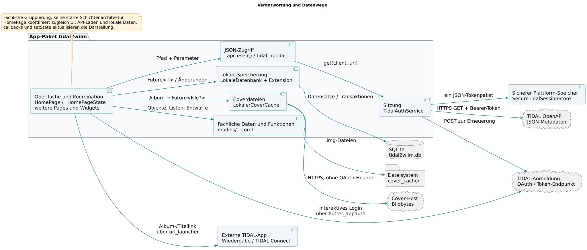

## 02 · Fachmodelle im Arbeitsspeicher

Objekte, fachliche Beziehungen und SQL-Tabellen sind unterschiedliche Sichten. Besonders wichtig: Kategorien speichern IDs, Albumtitel leben nur im Zustand der Detailseite.

**Quellstellen:** models/modelle.dart; core/sammlung.dart

[PlantUML](PlantUML/02_Klassen_Datenmodelle.puml) · [SVG](SVG/02_Klassen_Datenmodelle.svg) · [PNG](PNG/02_Klassen_Datenmodelle.png)

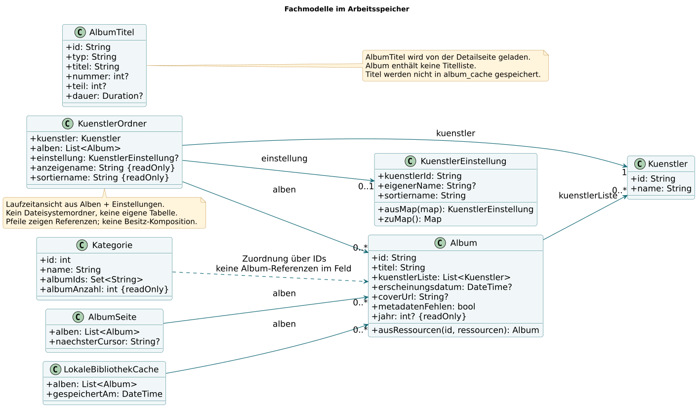

## 03 · Sitzungsverwaltung und Testbarkeit

Store, Uhr und HTTP-Client sind austauschbar. Deshalb lassen sich Ablaufzeit, Speicherausfälle und parallele Anfragen ohne echten TIDAL-Zugang testen.

**Quellstellen:** services/tidal_auth_service.dart; test/support/memory_session_store.dart

[PlantUML](PlantUML/03_Klassen_Sitzung.puml) · [SVG](SVG/03_Klassen_Sitzung.svg) · [PNG](PNG/03_Klassen_Sitzung.png)

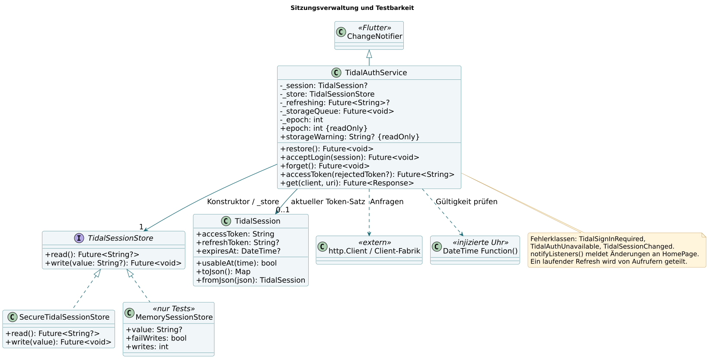

## 04 · Künstlereditor: Eingabe, Entwurf und Speicherung

Der Entwurf trennt vorläufige Eingaben vom gespeicherten Stand. Eine Dart-Extension ist keine Vererbung und erhält deshalb keinen Generalisierungspfeil.

**Quellstellen:** models/kuenstler_sortierung.dart; pages/kuenstler_sortiernamen_page.dart; data/kuenstler_sortierung_speichern.dart

[PlantUML](PlantUML/04_Klassen_Kuenstlereditor.puml) · [SVG](SVG/04_Klassen_Kuenstlereditor.svg) · [PNG](PNG/04_Klassen_Kuenstlereditor.png)

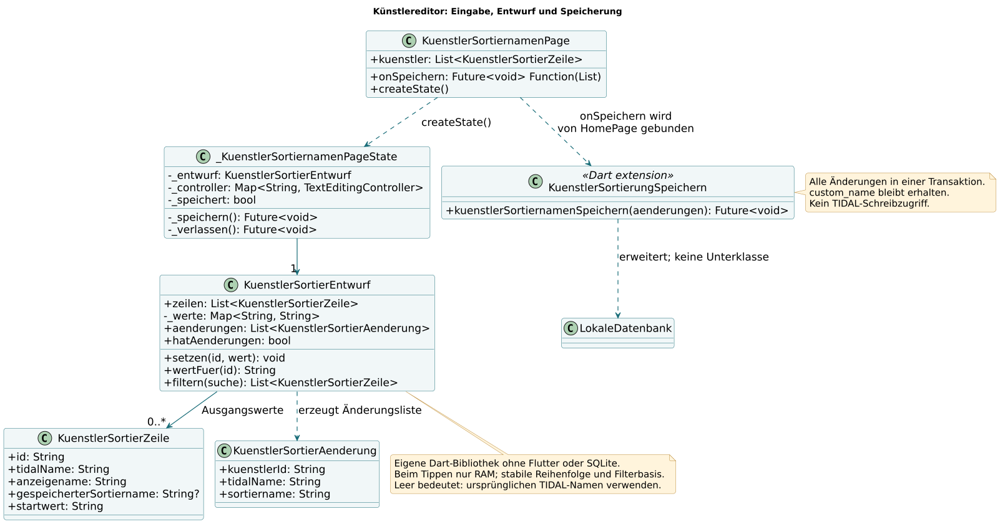

## 05 · Oberfläche: Objekte und Rückmeldungen

Widgets erhalten Daten und Funktionen über Konstruktoren. Ein Callback kann nach dem Speichern das Neuladen der übergeordneten Ansicht auslösen.

**Quellstellen:** main.dart; pages/*; widgets/album_grid.dart; widgets/album_cover.dart

[PlantUML](PlantUML/05_Klassen_Oberflaeche.puml) · [SVG](SVG/05_Klassen_Oberflaeche.svg) · [PNG](PNG/05_Klassen_Oberflaeche.png)

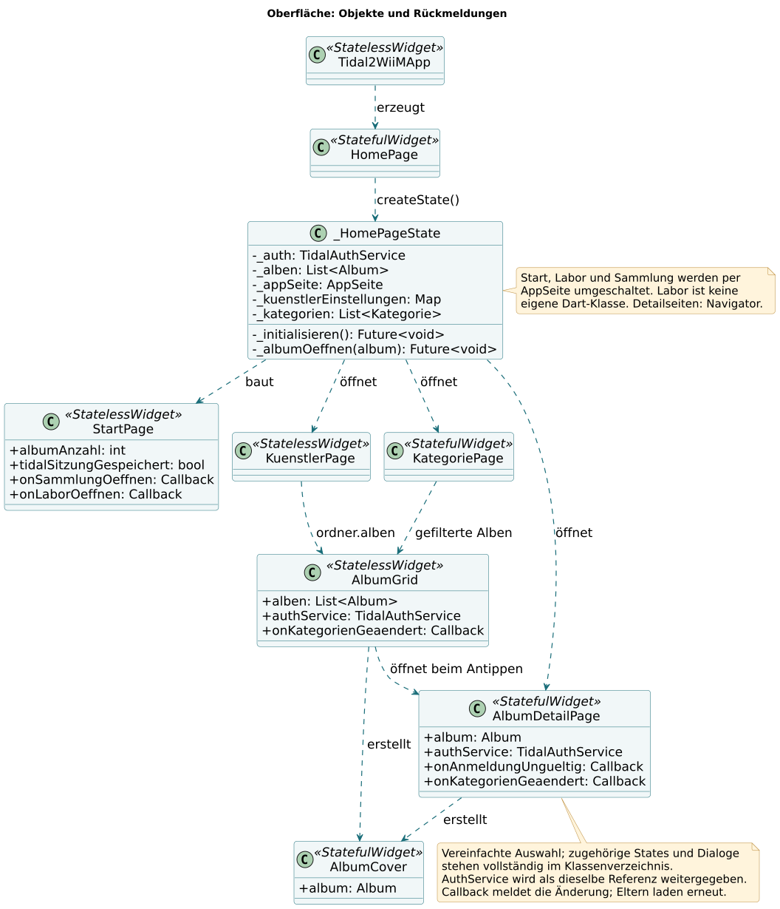

## 06 · Appstart: Cache und gespeicherte Sitzung

Zwei asynchrone Aufgaben starten gemeinsam. Ein geladener Cache erscheint unabhängig vom Abschluss einer späteren Netzwerkaktualisierung; Tokens und Alben werden getrennt gelesen.

**Quellstellen:** pages/home_page.dart: _initialisieren(), _bibliothekAusCacheLaden(); services/tidal_auth_service.dart: restore()

[PlantUML](PlantUML/06_Sequenz_Appstart.puml) · [SVG](SVG/06_Sequenz_Appstart.svg) · [PNG](PNG/06_Sequenz_Appstart.png)

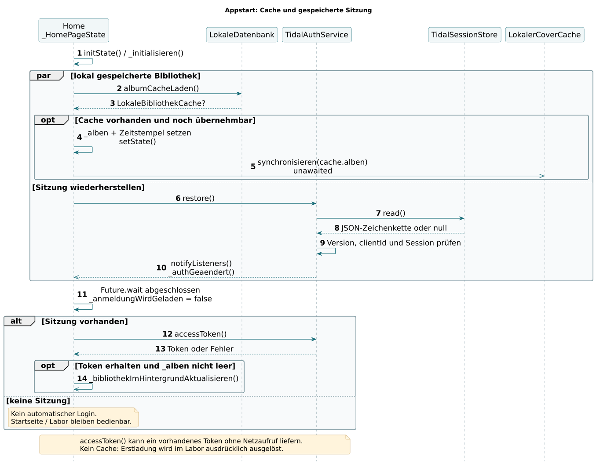

## 07 · Interaktive Anmeldung und sicheres Speichern

Erfolgreiche Anmeldung und erfolgreiche dauerhafte Speicherung sind zwei verschiedene Ergebnisse. Diese Unterscheidung verhindert falsche Versprechen beim nächsten Appstart.

**Quellstellen:** pages/home_page.dart: _login(); services/tidal_auth_service.dart: acceptLogin(), _persist()

[PlantUML](PlantUML/07_Sequenz_Anmeldung.puml) · [SVG](SVG/07_Sequenz_Anmeldung.svg) · [PNG](PNG/07_Sequenz_Anmeldung.png)

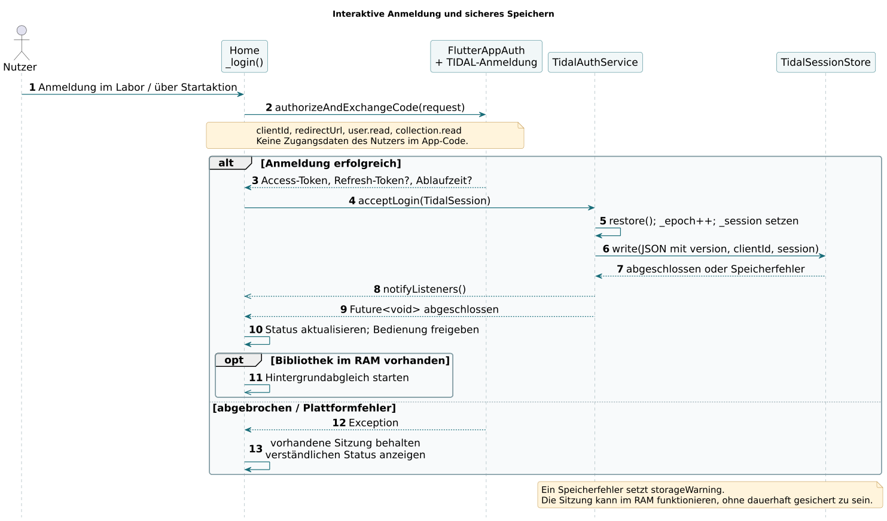

## 08 · Bibliothek laden: Vordergrund und Hintergrund

Beim Hintergrundabgleich bleibt die alte Ansicht bis zum vollständigen neuen Stand erhalten. Das Vordergrundladen zeigt dagegen bereits gelesene Teilmengen.

**Quellstellen:** pages/home_page.dart: _albenLaden(), _bibliothekImHintergrundAktualisieren(); data/lokale_datenbank.dart: albumCacheSpeichern()

[PlantUML](PlantUML/08_Sequenz_Bibliothek.puml) · [SVG](SVG/08_Sequenz_Bibliothek.svg) · [PNG](PNG/08_Sequenz_Bibliothek.png)

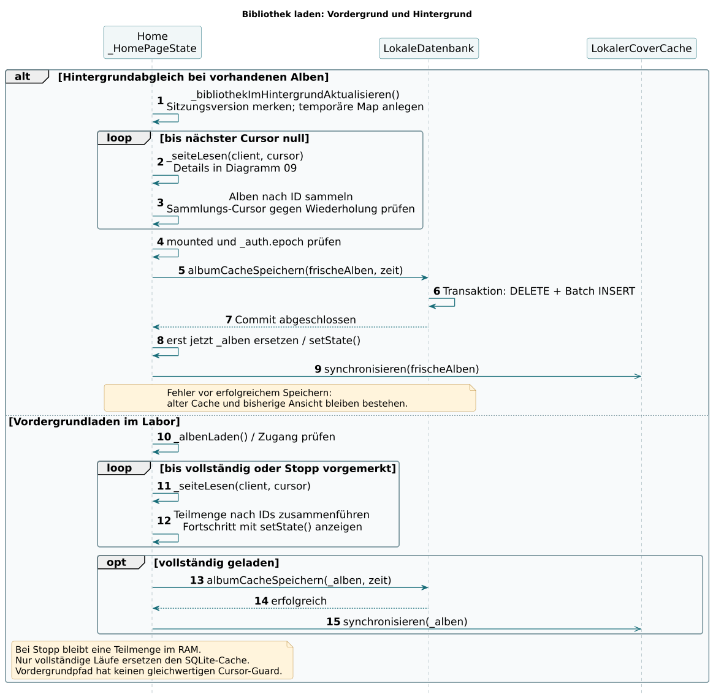

## 09 · Von JSON-Ressourcen zu Album-Objekten

Sammlungs-IDs und Album-Metadaten kommen aus getrennten Abfragen. Der Ressourcenindex löst die Beziehungen auf Künstler und Cover auf.

**Quellstellen:** pages/home_page.dart: _seiteLesen(); services/tidal_api.dart; models/modelle.dart: Album.ausRessourcen()

[PlantUML](PlantUML/09_Sequenz_Albumseite.puml) · [SVG](SVG/09_Sequenz_Albumseite.svg) · [PNG](PNG/09_Sequenz_Albumseite.png)

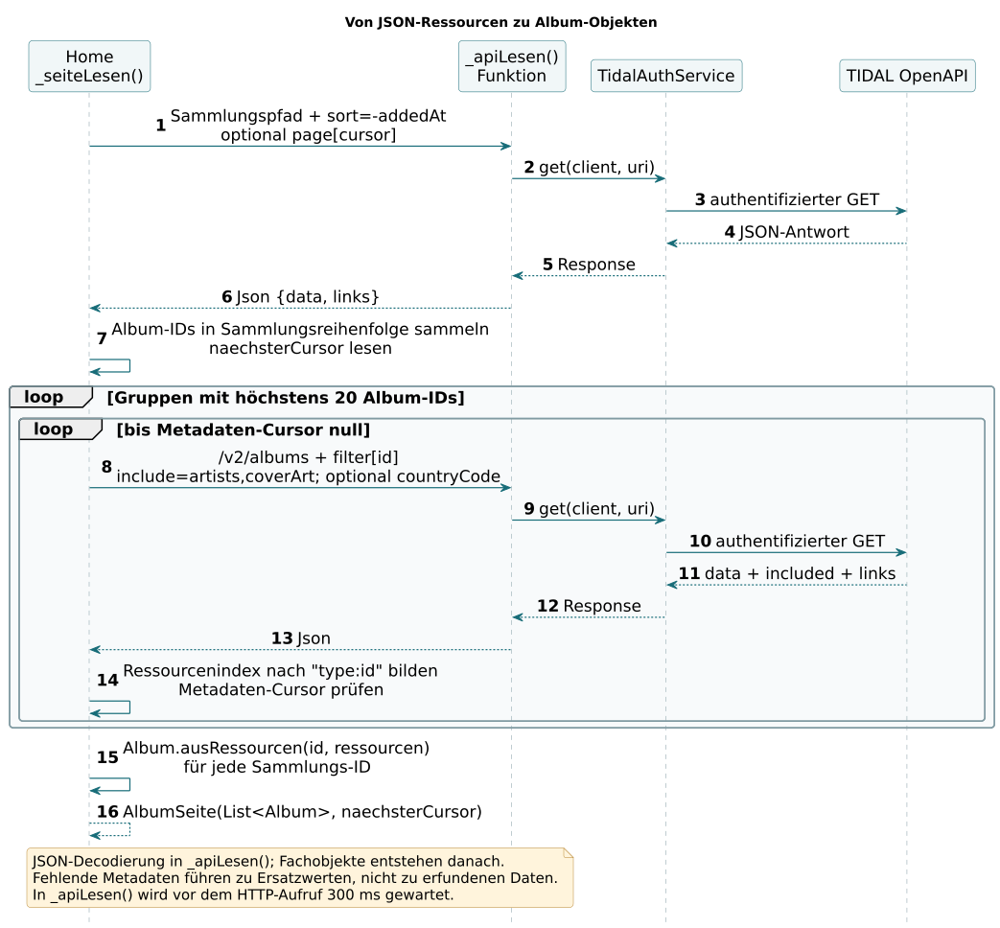

## 10 · API 401: einmal erneuern und wiederholen

Ein Netzwerkfehler ist kein Beweis für eine ungültige Anmeldung. Parallele Aufrufe teilen den Refresh; eine zweite Ablehnung endet ohne Endlosschleife.

**Quellstellen:** services/tidal_auth_service.dart: get(), accessToken(), _refresh(), _persist()

[PlantUML](PlantUML/10_Sequenz_Token401.puml) · [SVG](SVG/10_Sequenz_Token401.svg) · [PNG](PNG/10_Sequenz_Token401.png)

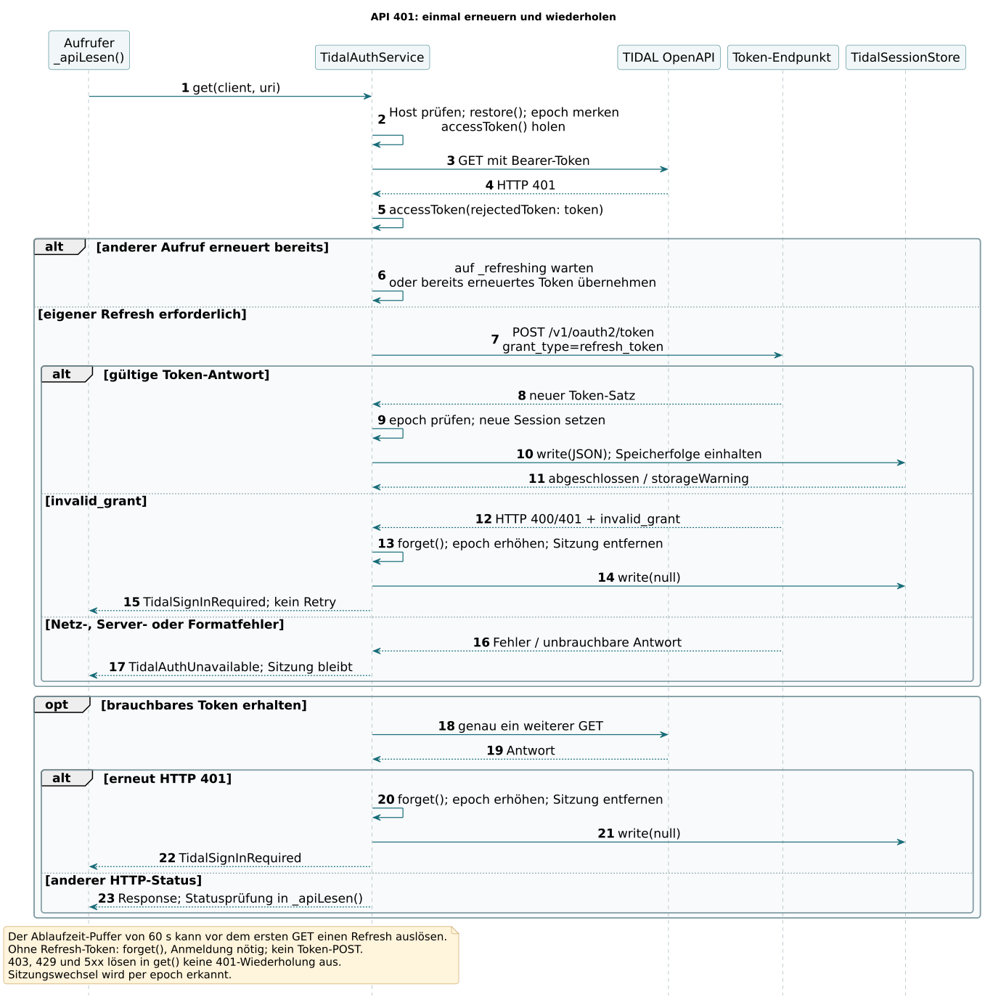

## 11 · Sortiernamen gesammelt bearbeiten und speichern

Kein Speichern pro Tastendruck: Eine bestätigte Änderungsliste wird gemeinsam geschrieben. Die Seite kennt das konkrete SQL nicht, sondern nur ihren Speicher-Callback.

**Quellstellen:** pages/home_page.dart: _kuenstlerSortiernamenOeffnen(); pages/kuenstler_sortiernamen_page.dart; models/kuenstler_sortierung.dart; data/kuenstler_sortierung_speichern.dart

[PlantUML](PlantUML/11_Sequenz_Kuenstlereditor.puml) · [SVG](SVG/11_Sequenz_Kuenstlereditor.svg) · [PNG](PNG/11_Sequenz_Kuenstlereditor.png)

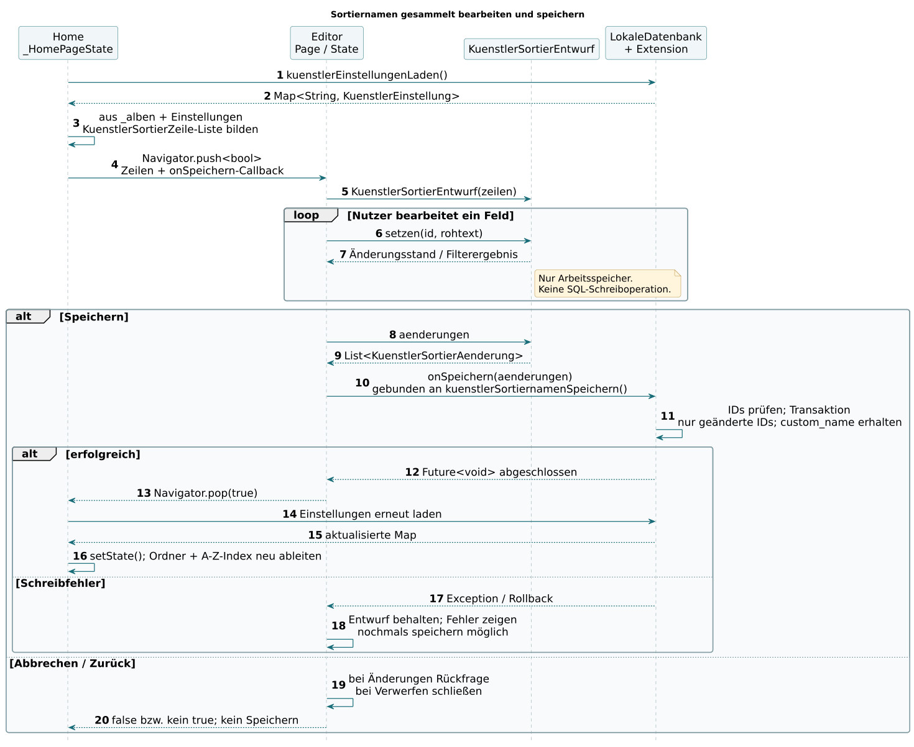

## 12 · Ein Album mehreren Kategorien zuordnen

Die Checkboxen liefern nur IDs. Erst die Detailseite veranlasst die Transaktion und meldet die Änderung an übergeordnete Seiten.

**Quellstellen:** pages/album_detail_page.dart: _kategorienBearbeiten(); widgets/dialoge.dart; data/lokale_datenbank.dart: albumKategorienSetzen()

[PlantUML](PlantUML/12_Sequenz_Kategorien.puml) · [SVG](SVG/12_Sequenz_Kategorien.svg) · [PNG](PNG/12_Sequenz_Kategorien.png)

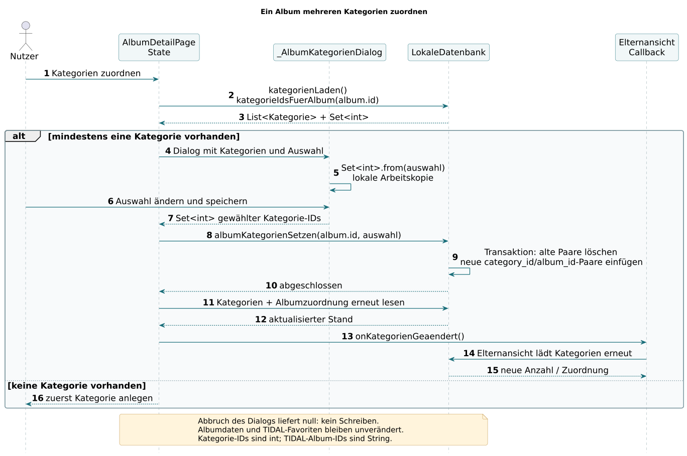

## 13 · Coveranzeige: Datei, Download und Ersatzanzeige

Ein File ist kein Albumdatensatz. Die Oberfläche erhält eine Datei oder null; der Coverabruf verwendet keinen OAuth-Bearer-Header.

**Quellstellen:** services/cover_cache.dart; widgets/album_cover.dart

[PlantUML](PlantUML/13_Sequenz_Cover.puml) · [SVG](SVG/13_Sequenz_Cover.svg) · [PNG](PNG/13_Sequenz_Cover.png)

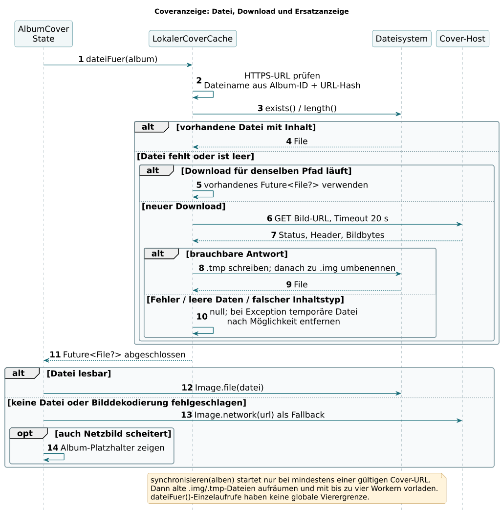

## 14 · Albumdetails laden und an TIDAL übergeben

Titelliste und Kategorien stammen aus verschiedenen Quellen. Ein externer Link ist eine Übergabe an eine andere App und kein eigener Musikplayer.

**Quellstellen:** pages/album_detail_page.dart: initState(), _titelLaden(), _inTidalOeffnen(), _titelInTidalOeffnen()

[PlantUML](PlantUML/14_Sequenz_Details_Wiedergabe.puml) · [SVG](SVG/14_Sequenz_Details_Wiedergabe.svg) · [PNG](PNG/14_Sequenz_Details_Wiedergabe.png)

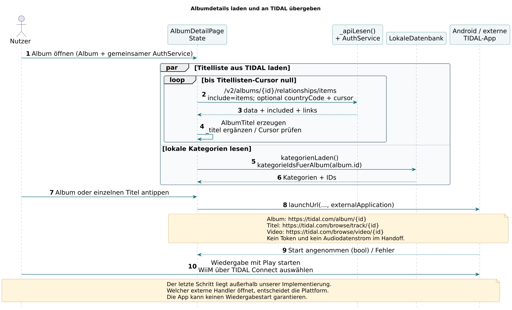
